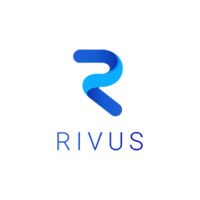

<!-- PROJECT LOGO -->
<br />
<p align="center">
  <a href="https://github.com/danjrauch/rivus">
    
  </a>

  <h3 align="center">rivus</h3>

  <p align="center">
    Rivus is a small time series database.
    <br />
    <a href="https://github.com/danjrauch/rivus"><strong>Explore the docs »</strong></a>
    <br />
    <br />
    <a href="https://github.com/danjrauch/rivus">View Demo</a>
    ·
    <a href="https://github.com/danjrauch/rivus/issues">Report Bug</a>
    ·
    <a href="https://github.com/danjrauch/rivus/issues">Request Feature</a>
  </p>
</p>


<!-- TABLE OF CONTENTS -->
<details open="open">
  <summary><h2 style="display: inline-block">Table of Contents</h2></summary>
  <ol>
    <li>
      <a href="#about-the-project">About The Project</a>
      <ul>
        <li><a href="#built-with">Built With</a></li>
      </ul>
    </li>
    <li>
      <a href="#getting-started">Getting Started</a>
      <ul>
        <li><a href="#prerequisites">Prerequisites</a></li>
        <li><a href="#installation">Installation</a></li>
      </ul>
    </li>
    <li><a href="#usage">Usage</a></li>
    <li><a href="#roadmap">Roadmap</a></li>
    <li><a href="#contact">Contact</a></li>
  </ol>
</details>


<!-- ABOUT THE PROJECT -->
## About The Project

Rivus is a small time series database. More to come...


### Built With

* [Nim](https://nim-lang.org)


<!-- GETTING STARTED -->
## Getting Started

To get a local copy up and running follow these simple steps.

### Prerequisites

* [Nim](https://nim-lang.org)

### Installation

## Development
1. Clone the Repo
   ```sh
   git clone https://github.com/danjrauch/rivus.git
   ```
2. Run the benchmarks
   ```sh
   nimble benchmark
   ```
3. Run the tests
   ```sh
   nimble test
   ```
4. Run the project as a binary
   ```sh
   nimble run && rm -R ./rivus
   ```
5. Compile to a shared library for use in backends
    ```sh
    nim c -d:release --noMain --header --app:lib -o:lib/rivus.so ./src/files.nim
    ```

## Development Dependencies


<!-- USAGE EXAMPLES -->
### Usage

Useful examples of how to use rivus are coming soon. Additional screenshots, code examples and demos will be added here.


<!-- ROADMAP -->
### Roadmap

See the [open issues](https://github.com/danjrauch/rivus/issues) for a list of proposed features (and known issues).


<!-- CONTACT -->
## Contact

Daniel Rauch - drauch@hawk.iit.edu

Project Link: [https://github.com/danjrauch/rivus](https://github.com/danjrauch/rivus)